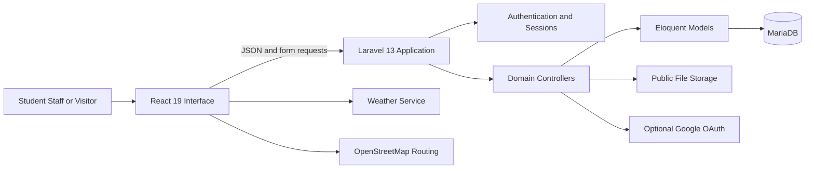
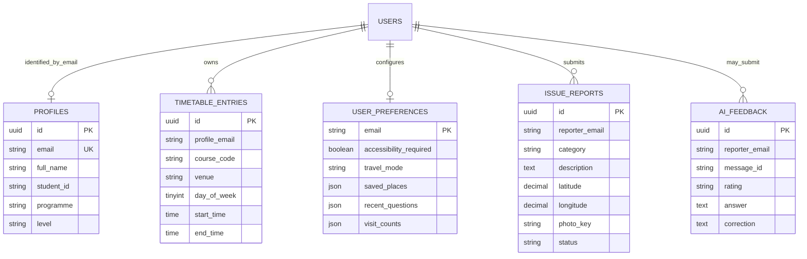
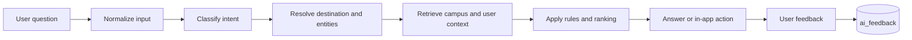

# UCC Campus Connect

## In-Depth Technical Project Report

**Programme:** Master of Science in Information Technology  
**Institution:** University of Cape Coast  
**Project type:** Group software engineering project  
**Date:** July 2026

### Group Members

| Name | Index number |
|---|---|
| Ebenezer Nana Annan | MS/ITE/25/0041 |
| Okyere-Darko Addai | MS/ITE/25/0044 |
| Frank Akrasi Antwi | MS/ITE/25/0051 |
| Michael Essel | MS/ITE/25/0053 |

---

## Abstract

UCC Campus Connect is a responsive smart-campus information system designed for students, staff and visitors of the University of Cape Coast. The project addresses the fragmentation of campus information across physical noticeboards, websites, informal messaging channels and personal knowledge. It provides a single interface for campus-place discovery, walking directions, personal timetables, weather context, campus updates, shuttle guidance, emergency information, issue reporting and a context-aware campus assistant.

The application uses a React 19 client compiled with Vite and served by a Laravel 13 application. Laravel provides routing, session authentication, server-side validation, file storage and REST-style JSON endpoints. MariaDB is the target database and stores users, academic profiles, timetable entries, preferences, issue reports and assistant-feedback records. The platform supports native email/password accounts. Google OAuth is optional and configuration-driven, while Sign in with ChatGPT is hidden unless a supported hosting environment supplies an appropriate sign-in URL.

The current Campus AI is a deterministic decision-support component rather than a generative large language model. It classifies user intent with explicit patterns, resolves destinations using aliases and edit distance, ranks nearby services using geographic distance and accessibility preferences, and combines user profile, timetable, weather, location and recent activity to produce contextual suggestions. This approach gives transparent and reproducible answers while establishing a clear migration path toward retrieval-grounded language-model services.

Verification covered PHP syntax, Laravel route registration, clean database migrations and automated authentication behavior. The current suite contains five passing tests with sixteen assertions, including account creation, local login, optional-provider visibility and homepage availability. The resulting system demonstrates a maintainable foundation for integrated campus services while identifying future needs in administration, usability research, observability, live transport data and institutional integration.

**Keywords:** smart campus, Laravel, MariaDB, React, campus navigation, contextual assistant, information systems, accessibility

---

## Table of Contents

1. Introduction  
2. Problem Statement  
3. Aim, Objectives and Research Questions  
4. Scope and Stakeholders  
5. Requirements Analysis  
6. Development Methodology  
7. System Architecture  
8. Database Design  
9. Backend and API Design  
10. Frontend Design and User Experience  
11. Campus AI Design  
12. Authentication and Authorization  
13. Security and Privacy  
14. External Services and Integrations  
15. Testing and Verification  
16. Deployment and Operations  
17. Limitations and Technical Debt  
18. Future Work  
19. Conclusion  
20. References  
Appendices

---

# 1. Introduction

Universities operate as geographically distributed communities. A student may need to locate a lecture venue, check an academic deadline, estimate travel time, find a shuttle stop and report a damaged facility within the same day. Although each piece of information may exist, the user experience becomes difficult when that information is distributed across unrelated channels.

UCC Campus Connect was developed as an integrated campus companion for the University of Cape Coast. The system brings together discovery, planning and response activities in one responsive web application. It is intended to reduce the effort required to answer common campus questions and to create a reusable data foundation for future digital-campus services.

The original prototype used a React-compatible cloud runtime and a serverless SQLite-style database. The project was subsequently converted into a conventional Laravel and MariaDB application. This conversion replaced platform-specific database bindings with Eloquent models, Laravel migrations and controllers. It also replaced hosting-specific identity headers with native in-app accounts and optional external identity providers. The result can be deployed on standard PHP infrastructure and managed with familiar Laravel operational practices.

## 1.1 Project Context

The application focuses on four recurring user needs:

- **Discover:** find buildings, halls, hostels, health facilities, banks, dining locations, transport stops and safety services.
- **Plan:** manage a personal timetable, check updates, interpret weather and plan travel.
- **Navigate:** identify destinations and obtain walking routes with contextual landmarks.
- **Respond:** access emergency information, submit issue reports and provide feedback on assistant answers.

## 1.2 Significance

The project is significant in three ways. First, it demonstrates integration across information categories that are usually treated as separate applications. Second, it shows how user context can improve otherwise static campus information. Third, its Laravel/MariaDB architecture provides a practical base for controlled institutional deployment, extension and data governance.

# 2. Problem Statement

Campus information is available but fragmented. A new student or visitor may know that a service exists without knowing where it is located. A student may have a timetable but no immediate connection between the next class, current position, travel time and route. Operational issues may be reported through informal channels that do not capture category, location, evidence and status consistently.

The problem is therefore not only the absence of information. It is the absence of a unified, contextual and actionable access layer. Fragmentation produces several effects:

- time is lost moving between sources or asking other people;
- place names and acronyms create uncertainty for new users;
- accessibility requirements are not consistently represented in recommendations;
- academic schedules are disconnected from campus navigation;
- transport estimates and weather context are rarely considered together;
- issue reports may lack structured location and evidence; and
- users cannot easily correct inaccurate automated answers.

The project responds by creating one application that connects information to the task the user is trying to complete.

# 3. Aim, Objectives and Research Questions

## 3.1 Aim

To design and implement an integrated smart-campus platform that improves access to location, academic, transport, safety and support information at the University of Cape Coast.

## 3.2 Objectives

1. Centralize campus places, updates and service information in one responsive interface.
2. Enable users to create independent in-app accounts and maintain academic profiles.
3. Support personal timetable creation, CSV import, reminders and contextual class guidance.
4. Provide destination matching, nearby-place discovery and walking-route previews.
5. Incorporate accessibility and travel preferences into recommendations.
6. Provide structured issue reporting with optional coordinates and photographic evidence.
7. Implement a transparent campus assistant grounded in verified application data.
8. Persist operational and personal data in MariaDB through Laravel models and migrations.
9. Apply server-side validation, authentication, CSRF protection and upload restrictions.
10. Establish a testable and extensible foundation for future institutional integration.

## 3.3 Research and Design Questions

- How can fragmented campus information be presented through a single task-oriented interface?
- Which forms of user context are most useful for campus recommendations?
- How can a campus assistant remain useful while keeping its reasoning transparent and bounded?
- What architecture best supports portability, maintainability and future institutional ownership?

# 4. Scope and Stakeholders

## 4.1 Primary Stakeholders

| Stakeholder | Primary needs | System support |
|---|---|---|
| Students | Classes, places, routes, updates, transport and safety | Profiles, timetable, assistant, map, preferences and reports |
| Staff | Facilities, events, services and issue reporting | Directory, updates, navigation and reports |
| Visitors | Orientation, landmarks, health and emergency contacts | Guest browsing, place discovery and safety information |
| Administrators | Structured operational records and content control | Database foundation; administrative interface remains future work |

## 4.2 In Scope

- responsive browser-based interface;
- native account registration and login;
- optional Google OAuth and configurable ChatGPT sign-in link;
- academic profiles;
- timetable CRUD operations and CSV upload;
- campus place directory and client-side filtering;
- weather, route and official-update integration;
- shuttle planning estimates;
- multilingual interface prompts and browser speech features;
- preference persistence;
- issue reports with images; and
- assistant-answer feedback.

## 4.3 Out of Scope

The current prototype is not an official emergency dispatch platform, student information system or live vehicle-tracking service. It does not yet provide an administrative content-management console, role-based moderation workflow, production analytics, institutional single sign-on or a hosted generative language model.

# 5. Requirements Analysis

## 5.1 Functional Requirements

| ID | Requirement | Implementation status |
|---|---|---|
| FR-01 | Users shall browse campus information as guests. | Implemented |
| FR-02 | Users shall register and sign in with an in-app account. | Implemented |
| FR-03 | External sign-in shall be optional. | Implemented through configuration |
| FR-04 | Authenticated users shall maintain a profile. | Implemented |
| FR-05 | Users shall add and delete timetable entries. | Implemented |
| FR-06 | Users shall import up to 100 timetable entries from CSV/API payloads. | Implemented |
| FR-07 | Users shall search and filter campus places. | Implemented |
| FR-08 | Users shall obtain walking routes when location permission is available. | Implemented through an external routing service |
| FR-09 | Users shall store saved places and travel preferences. | Implemented |
| FR-10 | Authenticated users shall submit issue reports and optional images. | Implemented |
| FR-11 | Users shall access campus updates and weather context. | Implemented with fallbacks |
| FR-12 | Users shall rate and correct assistant answers. | Implemented |

## 5.2 Non-Functional Requirements

- **Usability:** responsive layouts, visible calls to action and guest access.
- **Maintainability:** framework conventions, controllers, models, migrations and configuration separation.
- **Security:** password hashing, session regeneration, CSRF protection, authorization and input validation.
- **Performance:** client-side filtering, bounded arrays, indexed identity fields and cache headers for updates.
- **Portability:** PHP, MariaDB and Vite deployment without a proprietary database binding.
- **Accessibility:** saved accessibility preference and marked accessible destinations.
- **Reliability:** fallbacks for weather, location, routing and campus-update failures.
- **Extensibility:** discrete controllers and tables for major domains.

# 6. Development Methodology

The project followed an iterative design-and-build approach. Campus tasks were first represented as user journeys such as finding a lecture hall, planning travel to a class and reporting a facility problem. The journeys were converted into functional requirements and interface components. Features were then implemented incrementally and connected through shared context.

The technical conversion followed five stages:

1. **Inventory:** inspect the React interface, data schema and existing API contracts.
2. **Platform foundation:** introduce Laravel, Composer configuration, environment handling and public entry points.
3. **Data migration:** translate SQLite-style tables into MariaDB-compatible migrations and Eloquent models.
4. **Service migration:** replace serverless handlers with Laravel controllers, validation and sessions.
5. **Verification:** validate syntax, routes, migrations and automated authentication flows.

This approach preserved the existing user interface while changing the server architecture underneath it.

# 7. System Architecture

## 7.1 Architectural Style

The application uses a layered web architecture. The browser renders a React single-page interface. Requests to `/api/*` are handled by Laravel controllers. Controllers validate input and interact with Eloquent models. MariaDB provides persistent storage. Laravel's public filesystem stores uploaded issue photographs.



## 7.2 Component Responsibilities

| Layer | Technologies | Responsibilities |
|---|---|---|
| Presentation | React 19, CSS, Vite | UI state, maps, forms, assistant conversation, responsive behavior |
| Web application | Laravel 13, PHP 8.3+ | routes, sessions, validation, JSON responses, OAuth, uploads |
| Data access | Eloquent ORM | UUID generation, casts, queries and persistence |
| Database | MariaDB 10.6+ | relational and JSON data storage |
| Assets | Vite and Laravel public disk | compiled frontend assets and issue images |
| External services | Google OAuth, Open-Meteo, OSM routing | optional identity and live context |

## 7.3 Request Lifecycle

1. Laravel serves the Blade shell containing the CSRF token and Vite assets.
2. React mounts into the `#app` element and loads account, timetable, preferences and updates.
3. Same-origin fetch requests automatically include CSRF and XMLHttpRequest headers.
4. Laravel resolves the route and applies authentication middleware where required.
5. The controller validates input, performs model operations and returns JSON.
6. React updates local state and presents success, error or fallback information.

# 8. Database Design

Laravel's standard migrations create users, sessions/cache support and job infrastructure. The campus migration creates five domain tables.



## 8.1 Design Decisions

- UUIDs reduce dependence on sequential public identifiers for user-generated records.
- Email is used as the current ownership key across profile, timetable and preference data.
- JSON fields suit small, user-specific collections such as saved place IDs and recent questions.
- `profile_email` and `reporter_email` are indexed for user-scoped retrieval.
- Decimal coordinates preserve issue locations without requiring spatial extensions.
- Uploads are represented by storage paths rather than binary database fields.

## 8.2 Integrity Considerations

The current schema relies on application-level ownership checks rather than foreign-key constraints between email fields and users. This eases migration from the original schema but introduces a future improvement: replace email ownership columns with `user_id` foreign keys and define cascade behavior. Email changes would otherwise require coordinated updates.

# 9. Backend and API Design

The application exposes 21 registered routes, including pages, authentication, OAuth, JSON APIs, storage endpoints and health checks. Domain controllers keep each responsibility small.

## 9.1 API Summary

| Method | Endpoint | Authentication | Purpose |
|---|---|---|---|
| GET | `/api/account` | Optional | Return session identity and academic profile |
| POST | `/api/account` | Required | Create or update profile |
| GET | `/api/timetable` | Optional | Return the current user's entries or an empty list |
| POST | `/api/timetable` | Required | Add one or up to 100 entries |
| DELETE | `/api/timetable?id=` | Required | Delete a user-owned entry |
| GET | `/api/preferences` | Optional | Return saved or default preferences |
| POST | `/api/preferences` | Required | Update preferences, history and visits |
| POST | `/api/issues` | Required | Store an issue and optional image |
| POST | `/api/feedback` | Optional | Store assistant-answer feedback |
| GET | `/api/campus-updates` | Public | Return campus-update records and sources |

## 9.2 Validation

Laravel validation constrains profile levels, timetable day and time formats, report categories, upload types and sizes, feedback rating values and correction length. Timetable reminders are clamped between 0 and 120 minutes. Preference collections are bounded to prevent uncontrolled growth: saved places are limited to 100 and recent questions to 10.

## 9.3 Ownership Controls

Timetable queries always filter by the authenticated user's email. Deletion combines the requested UUID and owner email, preventing one user from deleting another user's entry. Reports take the reporter email from the authenticated session rather than trusting a client-supplied address.

# 10. Frontend Design and User Experience

The React application is implemented as a feature-rich client component. It maintains state for account information, timetable, preferences, weather, updates, selected places, routes, assistant messages and modal panels.

## 10.1 Main Interface Areas

- sticky navigation and account controls;
- homepage search and current-context card;
- quick actions for map, reports, emergency and assistant;
- searchable campus directory with categories and markers;
- updates and campus safety section;
- full-page and modal assistant experiences;
- timetable editor with CSV import;
- profile and preference management; and
- shuttle and route previews.

## 10.2 Timetable Import

The CSV importer expects the columns `course,title,day,start,end,venue,reminder`. It recognizes day names by prefix, attempts to match the venue to a mapped place, converts reminder values to numbers and sends valid rows to the timetable API. A sample MSc Information Technology timetable is included in `outputs/sample_msc_information_technology_timetable.csv`.

## 10.3 Responsive Design

CSS media queries simplify the navigation, grids, map-directory layout, modals and forms at tablet and mobile widths. Reduced-motion preferences disable transitions and smooth scrolling. The interface also uses semantic labels for important controls and modal roles.

# 11. Campus AI Design

The term Campus AI describes a context-aware campus decision assistant. The current implementation does not call GPT, another foundation model or a trained neural network. Its behavior is implemented in TypeScript and can be inspected directly.

## 11.1 Intent Classification

The assistant normalizes each user message and tests it against explicit patterns. Supported intents include directions, shuttle questions, travel duration, nearby discovery, issue reporting, campus updates, weather, emergency information, profiles, saved places and timetable queries. The bounded intent set keeps responses within the application's evidence base.

## 11.2 Destination Resolution

Destination matching proceeds in three stages:

1. match known aliases, with longer aliases evaluated first;
2. match a complete normalized place name inside the query; and
3. use word-level Levenshtein edit distance for fuzzy matching.

The fuzzy score divides matched query words by the larger of the query length and an adjusted place-name length. A destination is accepted only when the score is at least 0.42. This supports common spelling variations without accepting every weak similarity.

## 11.3 Proximity and Accessibility Ranking

Nearby discovery uses the Haversine formula to estimate distance between latitude/longitude coordinates. Candidate places are sorted by distance. When the user requests accessible places, non-accessible candidates receive a ranking penalty. The assistant returns the nearest three suitable results.

## 11.4 Contextual Suggestions

The recommendation rules consider:

- the next timetable entry and minutes until it starts;
- current location and estimated walking time;
- a five-minute arrival buffer;
- rain or high-temperature weather codes;
- profile level and programme;
- whether the timetable is empty;
- saved places and recent questions; and
- the last referenced campus place.

## 11.5 Grounding and Actions

Assistant responses are grounded in the local place catalogue, stored account context, timetable data, official-update records, weather data and route-service results. A response may select a map place, open a route, prepare an issue-report draft or show update cards. This makes the assistant an action layer rather than only a text generator.

## 11.6 Multilingual and Speech Support

The interface supports English, Fante, Twi, Ga and Ewe labels. Browser speech recognition accepts spoken input when available, while speech synthesis can read route steps. Availability and recognition quality depend on the browser and operating system.

## 11.7 Feedback Loop

Users can mark answers as helpful, not helpful or incorrect. Incorrect ratings require a correction. The backend stores the message ID, rating, question, answer, correction, optional place ID and optional user email. This creates evidence for reviewing assistant quality and improving rules.



## 11.8 Future Language-Model Integration

A future generative service should be introduced behind Laravel rather than called directly from the browser. The recommended pattern is retrieval-augmented generation over approved UCC content, source citations, strict tool schemas, short retention, rate limiting, safety filters and deterministic fallbacks. Evaluation should compare the language-model version against the current rule-based baseline for correctness, latency, cost and task completion.

# 12. Authentication and Authorization

## 12.1 Native Accounts

Users can create an independent Campus Connect account with name, email and password. Passwords require at least eight characters and are hashed. Registration immediately authenticates the user and regenerates the session. Login uses Laravel's authentication guard and also regenerates the session to reduce fixation risk.

## 12.2 Optional Google OAuth

Google sign-in is shown only when both a client ID and client secret exist. The authorization request includes a random state value stored in the session. The callback validates the state, exchanges the code on the server, retrieves OpenID user information and requires a verified email. The user is then found or created locally and logged into a Laravel session.

## 12.3 Optional ChatGPT Sign-In

`CHATGPT_SIGN_IN_URL` is blank by default. The button is displayed only when a supported hosting environment provides a valid flow. Native accounts never depend on it.

## 12.4 Guest Access

Public discovery remains available without authentication. User-specific writes such as profiles, timetables, preferences and issue reports require authentication. This balances low-friction campus access with ownership controls.

# 13. Security and Privacy

## 13.1 Implemented Controls

- password hashing through Laravel's user cast and hashing facade;
- server-managed sessions and regeneration after authentication;
- CSRF tokens attached to same-origin browser requests;
- authentication middleware on protected routes;
- server-side allow-lists and length/type validation;
- OAuth state verification and verified-email requirement;
- image-only uploads limited to 5 MB;
- generated storage paths rather than user-controlled filesystem paths;
- scoped timetable deletion; and
- environment-based secret configuration.

## 13.2 Privacy Considerations

The system stores identity, academic profile, timetable, preferences, approximate issue locations, optional issue photographs and assistant feedback. Production deployment should define retention periods, access roles, user data export/deletion procedures and audit logging. Sensitive operational reports should not be exposed through the public storage disk without an explicit authorization policy.

## 13.3 Security Improvements

Recommended improvements include email verification, password reset, rate limiting, secure-cookie enforcement, POST-only logout, private issue-photo storage, malware scanning, administrator roles, immutable audit logs, database foreign keys, content security policy and production secret management.

# 14. External Services and Integrations

| Integration | Purpose | Failure behavior |
|---|---|---|
| Open-Meteo | Current Cape Coast weather | Weather card remains loading/unavailable |
| OpenStreetMap routing | Walking route geometry and steps | Link to external OSM directions |
| Browser geolocation | Current origin and nearby search | Ask user to enable permission or select manually |
| Browser speech APIs | Voice input and spoken routes | Feature is disabled with a notice |
| Google OAuth | Optional identity | Button hidden without credentials |
| UCC update sources | Academic notices and event links | Static academic fallback records |

External service calls should receive timeouts, caching and monitoring before production deployment. The application must also respect each provider's usage policy.

# 15. Testing and Verification

## 15.1 Automated Tests

The current suite executed successfully with **5 tests and 16 assertions**:

- basic unit-test environment;
- homepage returns HTTP 200;
- a user can create an in-app account;
- a local account can sign in without an external provider; and
- optional provider controls remain hidden and the Google route returns 404 when unconfigured.

## 15.2 Structural Verification

- all inspected PHP files pass syntax checking;
- Laravel registers 21 routes;
- a clean migration creates framework and campus tables successfully;
- the MariaDB-oriented environment template uses `DB_CONNECTION=mysql`; and
- the authentication feature tests use an isolated in-memory SQLite database.

## 15.3 Testing Gaps

The current automated tests do not fully cover domain APIs, upload behavior, OAuth HTTP exchanges, authorization attacks, JavaScript components, accessibility or browser journeys. Before release, the project should add controller feature tests, mocked provider tests, component tests and end-to-end tests.

## 15.4 Proposed Usability Evaluation

A task-based study should recruit students, staff and first-time visitors. Suggested tasks are finding a lecture venue, importing a timetable, locating an accessible service, obtaining a route and submitting an issue. Measures should include completion rate, time on task, error rate, System Usability Scale score and qualitative feedback.

# 16. Deployment and Operations

## 16.1 Requirements

- PHP 8.3 or later;
- Composer;
- Node.js 20 or later;
- MariaDB 10.6 or later; and
- a web server capable of directing requests to `public/index.php`.

## 16.2 Installation

```bash
cp .env.example .env
composer install
php artisan key:generate
```

Create a MariaDB database named `smart_campus`, set the `DB_*` values and run:

```bash
php artisan migrate --force
php artisan storage:link
npm install
npm run build
```

For local development:

```bash
php artisan serve
npm run dev
```

## 16.3 Production Checklist

- set `APP_ENV=production` and `APP_DEBUG=false`;
- use HTTPS and secure session cookies;
- configure MariaDB backups and least-privilege credentials;
- cache Laravel configuration, routes and views;
- run queue workers under a process supervisor if queues are used;
- configure log rotation and centralized error monitoring;
- ensure `storage` and cache directories have correct permissions;
- register the production Google OAuth callback when enabled; and
- implement health, uptime and external-service monitoring.

# 17. Limitations and Technical Debt

1. The campus place catalogue is embedded in the frontend, so content changes require a new asset build.
2. Ownership currently uses email columns rather than user foreign keys.
3. Campus updates are currently represented by fallback records rather than a completed ingestion pipeline.
4. Shuttle arrival values are frequency-based estimates, not live vehicle locations.
5. The assistant uses deterministic rules and cannot handle unrestricted natural-language questions.
6. Multilingual support is phrase-based and does not translate every generated answer.
7. Issue photographs use the public disk and require a stronger authorization model for production.
8. The frontend is a large component and should be decomposed into domain components and hooks.
9. API response formatting and errors are not yet standardized through resources and exception handling.
10. Test coverage is concentrated on authentication rather than all critical workflows.

# 18. Future Work

## 18.1 Product Improvements

- administrative dashboard for places, updates, reports and feedback;
- live shuttle tracking and service alerts;
- push/email timetable reminders;
- searchable institutional content repository;
- verified accessibility audits and accessible-route data;
- report status tracking and notifications;
- offline-capable progressive web application; and
- student information system and institutional SSO integration.

## 18.2 Technical Improvements

- normalize ownership around `user_id` foreign keys;
- move place and shuttle data into MariaDB with administrative CRUD APIs;
- split the React application into typed feature modules;
- add Laravel API resources and consistent error envelopes;
- use private object storage and signed URLs for issue images;
- add caching, queues, retries and provider circuit breakers;
- introduce observability for latency, errors and external dependencies;
- expand unit, feature, component and browser test coverage; and
- establish CI/CD with migration, test, build and security gates.

## 18.3 AI Roadmap

The rule-based assistant should remain the baseline. A staged roadmap can add retrieval, embeddings and a language model only after content governance is established. Each stage should be evaluated for answer correctness, source fidelity, latency, cost, privacy and accessibility. High-risk actions such as emergency guidance and official report submission should continue to use deterministic controls and explicit user confirmation.

# 19. Conclusion

UCC Campus Connect demonstrates how campus information becomes more useful when it is connected to the user's current task. The platform integrates discovery, personal planning, navigation, safety and feedback through a single interface. Its conversion to Laravel and MariaDB replaces platform-specific infrastructure with a conventional, maintainable and deployable stack.

The project has delivered a working full-stack foundation with native accounts, optional identity providers, persistent user context, structured operational records and a transparent campus assistant. Its main contribution is not an individual feature but the integration of those features around real campus journeys. The next phase should focus on institutional data ownership, administrative workflows, user evaluation, security hardening and measured expansion of assistant capabilities.

# 20. References

1. UCC Campus Connect source code and project README, local repository, July 2026.
2. Laravel Documentation, https://laravel.com/docs
3. React Documentation, https://react.dev/
4. MariaDB Server Documentation, https://mariadb.com/docs/server/
5. Vite Documentation, https://vite.dev/guide/
6. OpenStreetMap, https://www.openstreetmap.org/
7. Open-Meteo API, https://open-meteo.com/
8. University of Cape Coast Academic Calendar, https://academics.ucc.edu.gh/academic-calendar

---

# Appendix A: Environment Variables

| Variable | Purpose |
|---|---|
| `APP_NAME` | Application display name |
| `APP_ENV` | Runtime environment |
| `APP_KEY` | Laravel encryption key |
| `APP_URL` | Canonical application URL |
| `DB_HOST`, `DB_PORT` | MariaDB connection location |
| `DB_DATABASE`, `DB_USERNAME`, `DB_PASSWORD` | Database credentials |
| `SESSION_DRIVER` | Session persistence driver |
| `FILESYSTEM_DISK` | Default file storage disk |
| `GOOGLE_CLIENT_ID`, `GOOGLE_CLIENT_SECRET` | Optional Google OAuth credentials |
| `CHATGPT_SIGN_IN_URL` | Optional supported ChatGPT sign-in flow |

# Appendix B: Timetable CSV Format

```csv
course,title,day,start,end,venue,reminder
MIT 701,Advanced Database Systems,Monday,17:00,19:00,C. A. Ackah Lecture Theatre (CALC),30
```

# Appendix C: Key Validation Rules

| Domain | Rule examples |
|---|---|
| Account | valid email; unique user; password minimum 8 characters |
| Profile | full name and programme minimum lengths; enumerated level |
| Timetable | 1-100 entries; day 0-6; `HH:MM` times; reminder 0-120 |
| Preferences | walking/shuttle mode; saved places capped at 100 |
| Issue | approved category; description and location; image maximum 5 MB |
| Feedback | approved rating; answer required; correction required for incorrect rating |

# Appendix D: Recommended Acceptance Criteria

- A new user can register, sign in and sign out without Google or ChatGPT.
- A guest can browse the campus directory.
- An authenticated user can import the supplied timetable CSV.
- A user cannot delete another user's timetable entry.
- Invalid report categories and oversized images are rejected.
- Optional OAuth buttons are invisible without configuration.
- Route failure produces a usable external-directions fallback.
- An incorrect assistant answer can be submitted with a correction.
